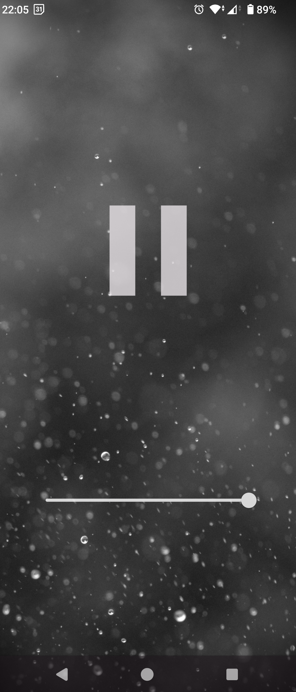

# Rain

This is a very simple app that loops [Calm Rain](https://commons.wikimedia.org/wiki/File:Calm_rain.wav).
It has a start/stop button and a volume button, I consider this app feature complete.
There are plenty of apps out there that do this, but are overloaded with features and complexity, so I wanted to have something very minimal.
The playback is not interrupted by audio focus, so it can be used alongside other media apps, which makes it ideal as a tinnitus masker.

## Implementation detail
I was struggling with getting the sound to loop perfectly, the solution is to use [MediaPlayer-Extended](https://github.com/protyposis/MediaPlayer-Extended).

## Google Play
I consider adding this app to google play in the future, but for now I want to test it for a few weeks.